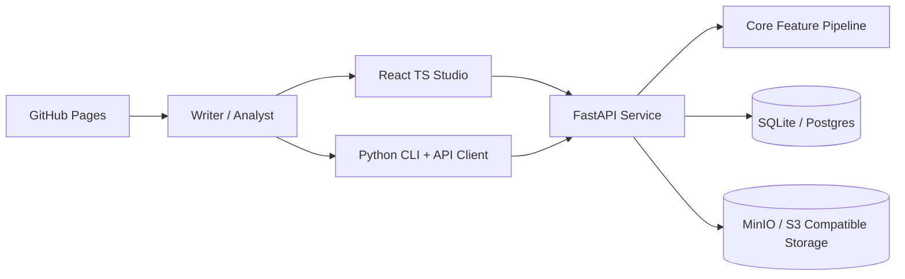
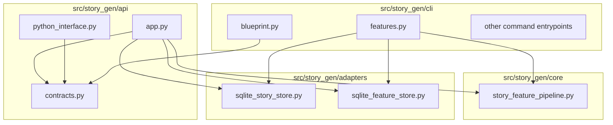
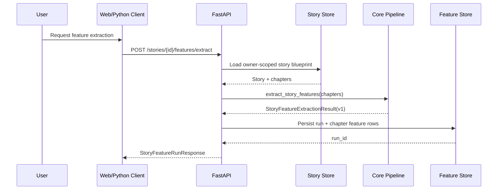
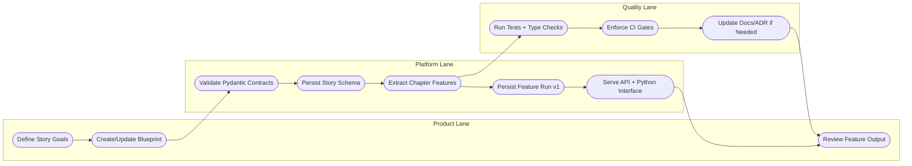
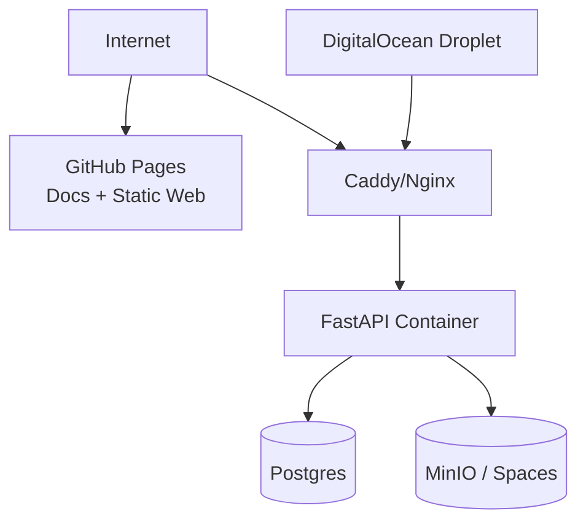

# Architecture Diagrams

This page keeps the big picture visual so the repository remains navigable even
as features grow.

## 1. System context

## 2. Internal backend component map

## 3. Story-first feature extraction flow

## 4. BPMN-style workflow (lanes)

## 5. Deployment topology (planned)

