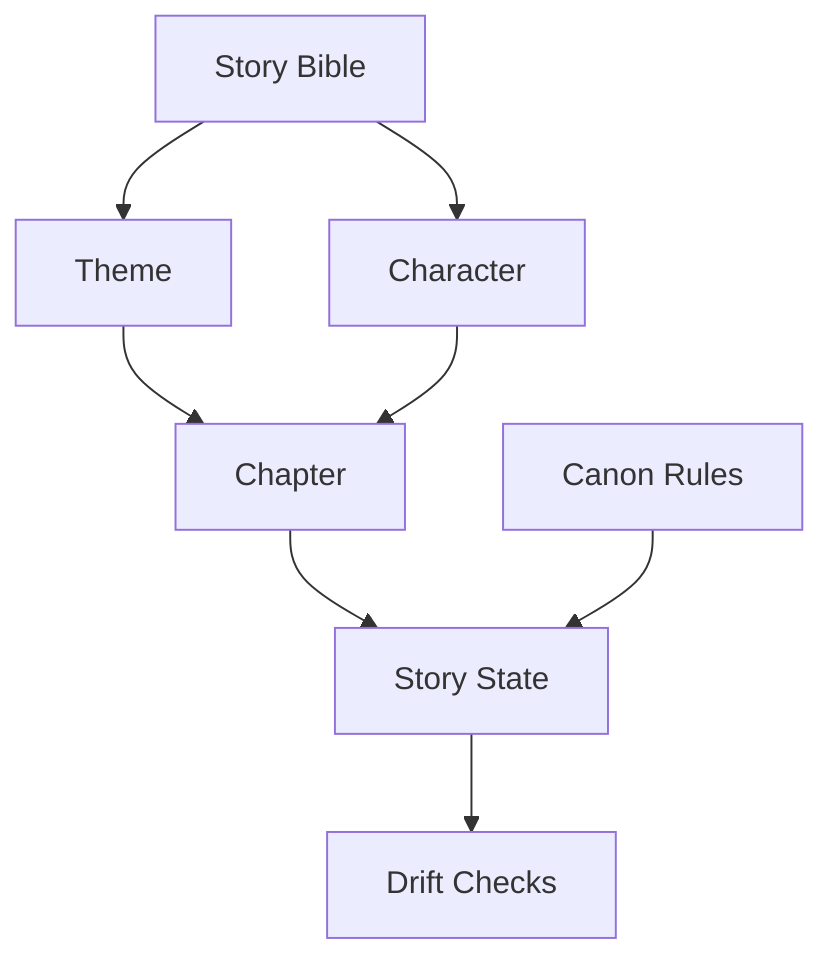
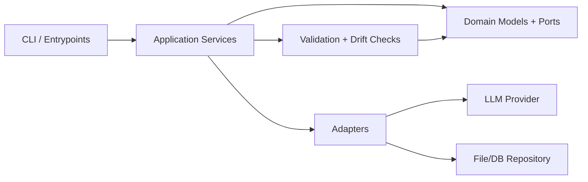
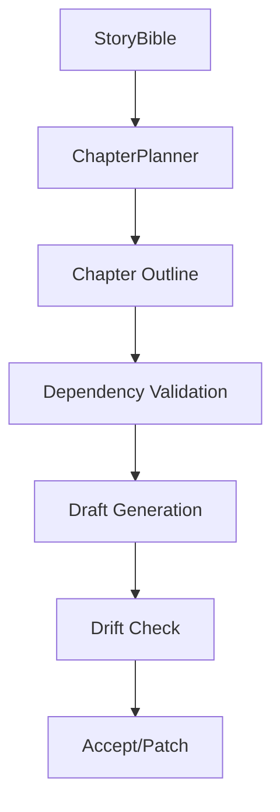

# Dependency Charts

These charts define high-level dependencies before concrete implementations are added.

## 1) Concept Dependency Graph

## 2) Implementation Layer Graph

## 3) Chapter Planning Flow

## Notes for concrete implementations

- Keep dependency direction inward: adapters depend on domain ports, not vice versa.
- Make drift checks pure where possible so they are testable and deterministic.
- Encode chapter prerequisites explicitly; avoid implicit sequence assumptions.
